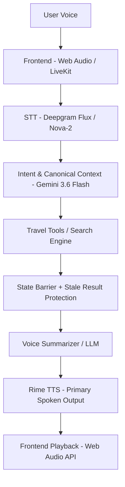

# VoiceTrip 🚄✈️🏨

> **Your AI Voice Travel Assistant**  
> Built for the **Rime Hackathon Challenge**.  
> Primary Spoken Output powered primarily by **Rime TTS**.

---

## 1. Project Overview
VoiceTrip is a voice-native travel assistant designed for hands-free, conversational travel planning. Whether searching trains, flights, hotels, or buses, VoiceTrip allows users to construct and modify travel plans purely through natural voice interactions.

The core voice engineering challenge VoiceTrip tackles is **barge-in interruption, recovery, and stale result protection** while the assistant is actively speaking or while background travel tools are running.

## 2. Problem
In traditional travel apps, configuring a trip (origin, destination, date, class, departure time, budget) requires navigating numerous dropdown menus, date pickers, and filter sliders. This is friction-heavy and impractical on the go.

Voice enables a fluid hands-free experience, but standard voice agents break down during real-world tasks that require asynchronous tool calls (e.g., querying train or flight databases with 3–8 second latencies). When a user refines their request midway through a search (e.g., *"Actually, only evening trains"*), standard voice architectures suffer from ghost audio collisions, stale state leakage, or complete conversational amnesia.

Removing voice from VoiceTrip would fundamentally destroy its value proposition: an interface where users can think out loud, interrupt the system safely, and change constraints on the fly without looking at a screen.

## 3. Why Voice Is Necessary
VoiceTrip is purpose-built as a voice-first system:
- **Realtime Interaction**: Audio streams are captured via LiveKit / Web Audio and processed in realtime.
- **Rime Spoken Output**: The assistant communicates back using expressive, low-latency Rime TTS (`mist` model, `amber` voice), creating a natural conversational partner.
- **Instant Interruption**: Users can cut off the assistant mid-sentence to issue corrections with $< 25\text{ ms}$ audio cutoff.
- **Hands-Free Workflow**: Visual cards accompany responses, but the full interaction loop is complete and intelligible through speech alone.
- **Conversational Follow-Ups**: The assistant maintains a canonical context ledger, so saying *"What about tomorrow?"* or *"Show cheaper ones"* retains prior journey entities.

## 4. Core Voice Challenge
**"Interruption and recovery during long-running travel searches."**

When querying travel tools, responses take time. VoiceTrip guarantees the following behavior:
- A user starts a travel request.
- The assistant is either speaking or displaying an active progress bar while awaiting tool results.
- The user interrupts to change or refine their request.
- Active Rime playback stops **immediately** ($< 25\text{ ms}$).
- **Stale background tool output is intercepted at the epoch barrier** and blocked from mutating conversation state or triggering speech.
- The updated request immediately becomes the authoritative state.
- The final Rime spoken response reflects only the newest request.

## 5. Key Features
- **Voice Input**: Realtime microphone capture via Web Audio / LiveKit.
- **Realtime / Interim Transcription**: Live STT provided by Deepgram (`flux-general-en` / `nova-2`) with railway acoustic keyterm boosting.
- **Travel Search Tools**: Train, flight, hotel, and bus search capabilities with realistic Indian corridor routing.
- **Non-Travel / General Intent Routing**: Natural conversational responses for greetings, jokes, and general questions without triggering travel tools.
- **Travel Follow-ups**: Preserves active `CanonicalTravelContext` and merges new constraints.
- **Interrupt AI Button**: Instant UI cutoff triggering generation epoch invalidation.
- **Rime Spoken Output**: Primary voice output synthesizing natural, conversational 1–3 sentence summaries.
- **Result Cards**: Native visual cards rendering returned train, flight, or hotel data.
- **Stale-Request Protection**: Monotonic generation epochs track and discard obsolete background tasks.

## 6. Demo Flow
To evaluate the project, follow this exact sequence:
1. Open the application at `http://127.0.0.1:5173/`.
2. Click **Start Mic** (or select a scenario button).
3. Speak a travel request: *"Find me trains from Kolkata to Delhi tomorrow."*
4. Click **Stop Mic** (or allow silence endpointing).
5. Watch the transcript appear in the feed.
6. The assistant processes the request (showing the 5.0-second progress bar).
7. While the tool is executing (or while Rime is speaking), click **Interrupt AI** or speak: *"Actually, only evening trains."*
8. Active Rime audio halts immediately ($< 25\text{ ms}$) and `gen_1` is tagged `[STALE - RESULT BLOCKED]`.
9. The `gen_2` turn processes with the merged `evening` constraint.
10. The final result and spoken Rime audio correctly reflect evening trains (*Rajdhani, Duronto*), proving zero stale leakage occurred.
11. Try a non-travel query: *"What can you do?"* or *"What is Python?"* (The assistant responds conversationally without invoking travel tools).
12. Try a follow-up: *"Show cheaper ones"* or switch domain to *"Find hotels in Goa"*.

## 7. Architecture

- **Rime TTS** serves as the **PRIMARY SPOKEN OUTPUT** at the culmination of the voice pipeline.
- The **State Barrier** intercepts asynchronous tool returns to ensure stale data from obsolete generation epochs never reaches the synthesis engine.

## 8. Technology Stack
- **Frontend**: React 19, Vite, TypeScript, Tailwind CSS, Web Audio API
- **Backend**: Python 3.10+, FastAPI, Uvicorn, Asyncio
- **Realtime Transport**: LiveKit WebRTC / WebSocket Hub
- **STT**: Deepgram Flux / Nova-2
- **LLM**: Google Gemini 3.6 Flash (via official `google-genai` SDK) with rule-based canonical fallback
- **TTS**: Rime TTS (Primary Output — `mist` model, `amber` voice)
- **Database**: Supabase (Optional for session persistence)

## 9. Rime Integration
Rime is exclusively used as the primary voice engine:
- **Rime Model ID**: `mist`
- **Rime Speaker/Voice**: `amber`
- **Language**: English (`en`)
- **Endpoint**: `https://users.rime.ai/v1/rime-tts`
- **Audio Format**: `mp3` (24,000 Hz, 16-bit mono)
- **Transport**: FastAPI backend sends HTTP POST requests to Rime API with JSON payload, decodes the base64 audio response, and streams binary audio to the frontend Web Audio API.
- **Integration Files**: [`backend/app/services/tts_service.py`](file:///d:/Rime%20PS/backend/app/services/tts_service.py) and [`frontend/src/hooks/useRimeAudioPlayer.ts`](file:///d:/Rime%20PS/frontend/src/hooks/useRimeAudioPlayer.ts).

**Playback & Control:**
Rime audio is streamed as binary to the browser where a Web Audio API buffer queues and plays it. If the user interrupts, the frontend issues an immediate `stopAudio()` command that flushes the buffer context instantly.

*Note: The Rime API key is securely managed server-side via the `.env` file and is never exposed to the client.*

## 10. Voice Interaction & Interruption
When a user begins speaking, audio is streamed to the backend WebSocket. Deepgram transcribes this in realtime. Upon silence endpointing or manual stop, finalized text is routed through intent classification.
If the user interrupts (via voice or the "Interrupt AI" button) while the assistant is speaking or awaiting a tool result:
- The active Rime audio buffer is flushed in $< 25\text{ ms}$.
- Active Python coroutines are cancelled via `asyncio.CancelledError`.
- The session `generation_id` epoch is incremented (`gen_1` $\to$ `gen_2`).
- Obsolete task results are caught at the barrier, tagged `[STALE - RESULT BLOCKED]`, and dropped.

## 11. Travel Capabilities
The assistant supports multiple travel modalities:
- **Trains**: Authentic Indian Railways schedules (Rajdhani, Duronto, Shatabdi, Express) with station code normalizer (`railway_normalizer.py`).
- **Flights**: Realistic airline schedules between major metros.
- **Hotels**: Accommodation searches with budget, rating, and location preference sorting.
- **Buses & Routes**: Intercity connectivity options.
- **General Travel Advice**: Packing tips, weather guidelines, and destination summaries handled natively by Gemini.

*Note: Inventory and pricing returned by search tools use authentic, realistic simulated datasets for prototype evaluation purposes.*

## 12. Input Routing
Every input passes through an explicit intent classifier:
- **Greetings** (*"Hello"*, *"Hi"*) $\to$ Conversational reply without travel tools.
- **General Questions** (*"What is Python?"*, *"Tell me a joke"*) $\to$ Conversational reply without travel tools.
- **Travel Requests** (*"Find flights from Kolkata to Delhi"*) $\to$ Triggers structured travel tool.
- **Travel Follow-ups** (*"Show cheaper ones"*, *"Actually, evening"*) $\to$ Inherits canonical context and re-triggers tool.
- **Ambiguous Requests** (*"Show me some"*) $\to$ Asks a concise clarification question.

## 13. Location & Entity Disambiguation
Explicit locations provided by the user in the current request always supersede stale context:
- *"Kolkata to Delhi trains tonight?"* resolves strictly to `origin = KOAA`, `destination = DLI` (and never silently becomes `Howrah`).
- Subsequent queries in a new domain (e.g., *"Find hotels in Jaipur"*) cleanly clear the previous train origin.

## 14. Installation & Setup

**Prerequisites**: Python 3.10+, Node.js v18+

```bash
# Clone the repository
git clone https://github.com/abhijit384/VoiceTrip.git
cd "Rime PS"

# Configure environment variables
cp .env.example .env
```

### Backend Setup:
```bash
cd backend
python -m venv .venv

# Activate virtual environment:
# Windows PowerShell:
.\.venv\Scripts\activate
# macOS / Linux:
# source .venv/bin/activate

pip install -r requirements.txt
```

### Frontend Setup:
```bash
cd ../frontend
npm install
```

## 15. Environment Variables
See `.env.example` for the complete template. Key variables:

| Variable | Purpose | Required |
|---|---|---|
| `RIME_API_KEY` | Authenticates with Rime TTS | Yes |
| `RIME_API_URL` | Rime TTS endpoint (`https://users.rime.ai/v1/rime-tts`) | Yes |
| `GEMINI_API_KEY` | Google Gemini API key for NLU / Intent | Yes |
| `DEEPGRAM_API_KEY` | Deepgram API key for realtime STT | Yes |
| `LIVEKIT_URL` | LiveKit Cloud WebRTC project URL | Optional / Realtime |
| `LIVEKIT_API_KEY` | LiveKit authentication key | Optional / Realtime |
| `LIVEKIT_API_SECRET` | LiveKit authentication secret | Optional / Realtime |

*Note: API keys are securely read from `.env` on the backend. No secrets are tracked in version control.*

## 16. Running Locally

**Start Backend** (Terminal 1):
```bash
cd backend
python -m uvicorn main:app --host 127.0.0.1 --port 8000
```

**Start Frontend** (Terminal 2):
```bash
cd frontend
npm run dev -- --host 127.0.0.1 --port 5173
```
Open `http://127.0.0.1:5173/` in Google Chrome or Microsoft Edge.

## 17. Automated Testing
Run the backend test suite:
```bash
cd backend
pytest ..\tests\test_interruption_recovery.py -v
```
To run tool and API verification tests:
```bash
pytest ..\tests\test_tool_service.py ..\tests\test_tool_api.py -v
```

## 18. Rime Acceptance Evidence
See [`RIME_EVIDENCE.md`](file:///d:/Rime%20PS/RIME_EVIDENCE.md) for the hard-voice claim, test procedures, measured results, and full acceptance logs for Tests A through F.

## 19. Demo & Deliverable Links
- **Live Demo**: https://voice-trip.vercel.app/
- **Demo Video**: https://drive.google.com/file/d/1sGPDzMD1Fni7CF0dyVlA_QUw2goQ0VTD/view?usp=sharing
- **Source Repository**: https://github.com/abhijit384/VoiceTrip
- **Architecture Documentation**: [`docs/ARCHITECTURE.md`](file:///d:/Rime%20PS/docs/ARCHITECTURE.md)
- **Rime Evidence Document**: [`RIME_EVIDENCE.md`](file:///d:/Rime%20PS/RIME_EVIDENCE.md)

## 20. Documented Limitations
- **Prototype Travel Data**: Search inventory uses realistic in-memory schedules rather than live IRCTC/GDS booking gateways.
- **Browser Autoplay Policy**: Browsers require initial user interaction before allowing programmatic Web Audio playback.
- **Physical Room Acoustics**: In open speaker environments without headphones, acoustic bleeding into the mic can trigger barge-ins; client-side audio muting mitigates this.

## 21. Failure Recovery
- **Microphone Denied**: UI presents error badge; user can trigger simulation buttons.
- **STT Fails**: Falls back to browser SpeechRecognition or direct text entry.
- **Rime Fails / Offline**: Falls back to local 24kHz synthesized formant audio to prevent pipeline crashes.
- **User Interrupts**: Ongoing Rime playback halts in $< 25\text{ ms}$, background tasks aborted via `asyncio.CancelledError`.
- **Stale Tool Result**: Intercepted by epoch barrier and tagged `[STALE - RESULT BLOCKED]`.

## 22. Project Structure
```
Rime PS/
├── README.md
├── RIME_EVIDENCE.md
├── SUBMISSION_CHECKLIST.md
├── .env.example
├── docs/
│   └── ARCHITECTURE.md
├── backend/
│   ├── app/
│   │   ├── api/
│   │   ├── core/
│   │   ├── models/
│   │   └── services/
│   ├── main.py
│   └── requirements.txt
├── frontend/
│   ├── src/
│   │   ├── components/
│   │   ├── hooks/
│   │   └── utils/
│   ├── package.json
│   └── vite.config.ts
└── tests/
    ├── test_interruption_recovery.py
    ├── test_tool_service.py
    └── browser_e2e_test.cjs
```
